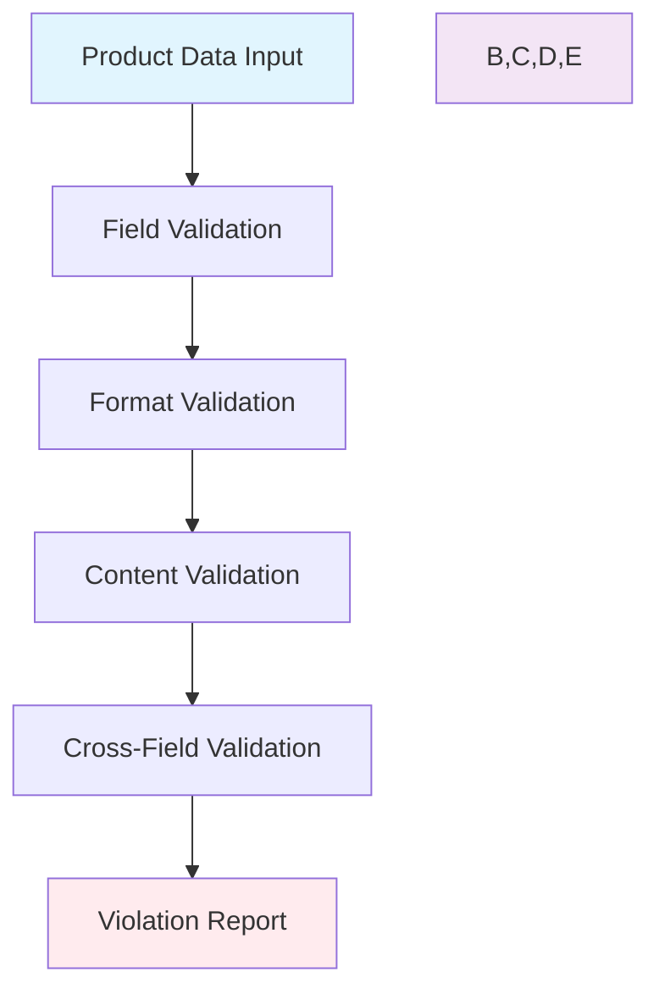

# Legal Metrology Compliance Validator

**A comprehensive validation engine for Indian Legal Metrology (Packaged Commodities) Rules, 2011.**

This module provides automated compliance checking for e-commerce and retail product data, ensuring adherence to legal requirements for packaged goods sold in India. Designed to integrate seamlessly with OCR pipelines and data processing systems.

[](https://python.org)
[](../LICENSE)
[](https://consumeraffairs.nic.in/)

## 🎯 Overview

The `ComplianceValidator` class implements a robust validation system that checks product information against **13+ specific Legal Metrology rules**. This system is specifically designed for:

- **E-commerce platforms** validating product listings
- **OCR pipelines** processing product label data
- **Retail systems** ensuring compliance before product launch
- **Quality assurance** teams validating product information

### Key Capabilities
- ✅ **13+ Validation Rules**: Comprehensive coverage of Legal Metrology requirements
- 🔍 **Flexible Input Handling**: Gracefully handles missing or `None` values (common in OCR)
- 📊 **Severity Classification**: Categorizes violations as Critical, High, Medium
- 📋 **Detailed Reports**: Returns structured violation reports with rule IDs and descriptions
- 🛡️ **Production Ready**: Comprehensive error handling and logging
- 🚀 **Easy Integration**: Simple API for embedding in existing systems

## 🏗️ Architecture



## 📋 Supported Validation Rules

### Critical Requirements (Must-Have Fields)
| Rule ID | Description | Field Validated |
|---------|-------------|-----------------|
| `LM_RULE_01_MRP_MISSING` | MRP is mandatory | `mrp` |
| `LM_RULE_02_NET_QTY_MISSING` | Net Quantity is mandatory | `net_quantity` |
| `LM_RULE_03_ORIGIN_MISSING` | Country of Origin is mandatory | `country_of_origin` |
| `LM_RULE_04_MFG_DETAILS_MISSING` | Manufacturer/Importer details required | `manufacturer_details` |
| `LM_RULE_05_DATE_MISSING` | Manufacturing/Import date required | `date_of_manufacture` |
| `LM_RULE_06_CARE_INFO_MISSING` | Consumer care details required | `consumer_care` |

### Format & Content Validation
| Rule ID | Description | Validation Type |
|---------|-------------|-----------------|
| `LM_RULE_07_MRP_FORMAT` | MRP format validation | Currency format (₹/Rs.) |
| `LM_RULE_08_NET_QTY_FORMAT` | Net quantity format validation | Unit validation (g/kg/ml/L) |
| `LM_RULE_09_DATE_FUTURE` | Date cannot be in future | Date logic validation |
| `LM_RULE_10_CARE_INFO_FORMAT` | Contact info format validation | Email/Phone validation |

### Conditional & Category-Specific Rules
| Rule ID | Description | Condition |
|---------|-------------|-----------|
| `LM_RULE_11_BEST_BEFORE_MISSING` | Best before date for perishables | Groceries/Personal Care/Medicine |
| `LM_RULE_12_IMPORT_DATE_MISSING` | Import date for imported products | When importer details present |
| `LM_RULE_13_USP_MISSING` | Unit sale price for groceries | Grocery category items |

## 🚀 Quick Start

### Installation
The validator is included with the main OCR pipeline. No separate installation required.

### Basic Usage

```python
from lmpc_checker.compliance_validator import ComplianceValidator

# Initialize validator
validator = ComplianceValidator()

# Product data to validate
product_data = {
    "product_id": "SKU-ELEC-001",
    "category": "Electronics",
    "manufacturer_details": "Noise, Gurugram, Haryana, 122001",
    "net_quantity": "1 Unit",
    "mrp": "₹1999",
    "country_of_origin": "India",
    "date_of_manufacture": "08/2024",
    "consumer_care": "help@go-noise.com, +91 88821 32132"
}

# Validate compliance
violations = validator.validate(product_data)

# Check results
if violations:
    print(f"❌ Found {len(violations)} compliance violations:")
    for violation in violations:
        print(f"  • {violation['description']}")
        print(f"    Rule: {violation['rule_id']}")
        print(f"    Severity: {violation['severity']}")
else:
    print("✅ Product is fully compliant!")
```

### Running the Demo
```bash
cd lmpc_checker
python main.py
```

## 📊 Input Data Schema

The validator expects a dictionary with the following fields (all optional, but required fields will generate violations if missing):

```python
{
    "product_id": "str",              # Product identifier
    "category": "str",                # Product category (Electronics, Groceries, etc.)
    "manufacturer_details": "str",    # Full manufacturer name and address
    "importer_details": "str",        # Importer information (if applicable)
    "net_quantity": "str",            # Net quantity with units (e.g., "500g", "1L", "1 Unit")
    "mrp": "str",                     # Maximum Retail Price (e.g., "₹299.00")
    "unit_sale_price": "str",         # Unit selling price (for groceries)
    "country_of_origin": "str",       # Country of origin
    "date_of_manufacture": "str",     # Manufacturing date (MM/YYYY format)
    "date_of_import": "str",          # Import date (if applicable)
    "best_before_date": "str",        # Expiry/best before date
    "consumer_care": "str",           # Customer care contact information
    "dimensions": "str",              # Product dimensions
    "contents": "str"                 # Product contents/ingredients
}
```

## 📋 Output Format

The `validate()` method returns a list of violation dictionaries:

```python
[
    {
        "rule_id": "LM_RULE_01_MRP_MISSING",
        "description": "The Maximum Retail Price (MRP) is a mandatory declaration and is missing.",
        "violating_field": "mrp",
        "severity": "critical"
    }
]
```

### Severity Levels
- **`critical`**: Must be fixed before product can be sold legally
- **`high`**: Important compliance requirements that should be addressed
- **`medium`**: Recommended improvements for better compliance

## 🧪 Examples and Test Cases

### ✅ Compliant Product Example
```python
compliant_product = {
    "product_id": "SKU-FOOD-001",
    "category": "Food",
    "manufacturer_details": "GoodFood Ltd, Food Park, Chennai-600001, Tamil Nadu",
    "net_quantity": "500g",
    "mrp": "₹150.00",
    "country_of_origin": "India",
    "date_of_manufacture": "08/2024",
    "consumer_care": "1800-GOOD-FOOD, care@goodfood.com"
}

violations = validator.validate(compliant_product)
# Result: [] (no violations)
```

### ❌ Non-Compliant Product Example
```python
non_compliant_product = {
    "product_id": "SKU-INVALID-001",
    "category": "Electronics",
    "manufacturer_details": None,     # Missing critical field
    "net_quantity": "invalid unit",   # Invalid format
    "mrp": "0",                      # Invalid MRP
    "country_of_origin": None,       # Missing critical field
    "consumer_care": "123"           # Invalid contact format
}

violations = validator.validate(non_compliant_product)
# Result: Multiple violations for missing and invalid fields
```

### 🏪 Grocery-Specific Validation
```python
grocery_product = {
    "product_id": "SKU-GROCERY-001",
    "category": "Groceries",
    "manufacturer_details": "Fresh Foods Pvt Ltd, Mumbai-400001",
    "net_quantity": "1kg",
    "mrp": "₹199.00",
    "country_of_origin": "India",
    "date_of_manufacture": "09/2024",
    "best_before_date": "09/2025",    # Required for groceries
    "consumer_care": "care@freshfoods.com",
    "unit_sale_price": "₹199.00/kg"  # Required for groceries
}
```

## 🔧 Advanced Usage

### Custom Validation Workflow
```python
from lmpc_checker.compliance_validator import ComplianceValidator

class CustomComplianceChecker:
    def __init__(self):
        self.validator = ComplianceValidator()
    
    def check_batch(self, products):
        """Validate multiple products at once"""
        results = []
        for product in products:
            violations = self.validator.validate(product)
            results.append({
                'product_id': product.get('product_id'),
                'compliant': len(violations) == 0,
                'violation_count': len(violations),
                'critical_violations': [v for v in violations if v['severity'] == 'critical'],
                'all_violations': violations
            })
        return results
    
    def compliance_summary(self, products):
        """Generate compliance summary report"""
        results = self.check_batch(products)
        total = len(results)
        compliant = sum(1 for r in results if r['compliant'])
        
        return {
            'total_products': total,
            'compliant_products': compliant,
            'compliance_rate': f"{(compliant/total*100):.1f}%" if total > 0 else "0%",
            'products_needing_attention': total - compliant
        }

# Usage
checker = CustomComplianceChecker()
summary = checker.compliance_summary(product_list)
print(f"Compliance Rate: {summary['compliance_rate']}")
```

### Integration with OCR Pipeline
```python
from live_processor import LiveProcessor
from data_refiner.refiner import DataRefiner
from lmpc_checker.compliance_validator import ComplianceValidator

class FullCompliancePipeline:
    def __init__(self):
        self.ocr_processor = LiveProcessor()
        self.data_refiner = DataRefiner()
        self.validator = ComplianceValidator()
    
    def process_image_to_compliance(self, image_path):
        """Complete pipeline from image to compliance report"""
        # Step 1: OCR Processing
        ocr_result = self.ocr_processor.process_single_capture()
        
        # Step 2: Data Refinement
        clean_data = self.data_refiner.refine(ocr_result)
        
        # Step 3: Compliance Validation
        violations = self.validator.validate(clean_data)
        
        return {
            'extracted_data': clean_data,
            'compliance_status': 'COMPLIANT' if not violations else 'NON_COMPLIANT',
            'violations': violations,
            'violation_count': len(violations)
        }
```

## 🔍 Validation Logic Details

### MRP Validation
- **Accepted formats**: `₹1999`, `Rs. 1999`, `Rs.1999.00`
- **Rejected formats**: `1999 rupees`, `INR 1999`, `0`

### Net Quantity Validation
- **Accepted units**: `g`, `kg`, `ml`, `L`, `cm`, `m`, `N`, `Unit`, `Units`, `Piece`, `Pieces`
- **Examples**: `500g`, `1.5kg`, `250ml`, `1 Unit`, `2 Pieces`

### Date Validation
- **Accepted formats**: `MM/YYYY`, `DD/MM/YYYY`, `MM-YYYY`, `YYYY-MM-DD`
- **Logic**: Manufacturing/Import dates cannot be in the future

### Contact Information Validation
- **Email pattern**: Standard email regex validation
- **Phone patterns**: 
  - 10-digit Indian mobile: `9876543210`
  - With country code: `+91 9876543210`, `91-9876543210`
  - Formatted: `98765-43210`, `+91 98765 43210`

## 📁 Module Structure

```
lmpc_checker/
├── 📄 README.md                    # This documentation
├── 🔧 compliance_validator.py      # Main ComplianceValidator class
├── 🚀 main.py                      # Demonstration script with examples
└── 📋 (Future: test_suite.py)      # Comprehensive test cases
```

### File Descriptions

#### `compliance_validator.py`
- **ComplianceValidator class**: Main validation engine
- **Rule definitions**: All 13+ validation rules with severity levels
- **Helper methods**: Format validation, date parsing, pattern matching
- **Error handling**: Graceful handling of malformed input data

#### `main.py`
- **Demo script**: Comprehensive examples showing validator usage
- **Test cases**: Multiple product scenarios including compliant and non-compliant examples
- **Output formatting**: Structured display of validation results
- **Category testing**: Examples for different product categories

## 🧪 Testing and Validation

### Running the Demo
```bash
# Navigate to the lmpc_checker directory
cd lmpc_checker

# Run the comprehensive demo
python main.py
```

### Expected Output
The demo script tests three scenarios:
1. **Electronics product** with future date violation
2. **Product with missing MRP** (critical violation)
3. **Grocery product** with multiple compliance issues

### Adding Custom Test Cases
```python
# Add to main.py or create your own test script
def test_custom_scenario():
    validator = ComplianceValidator()
    
    custom_product = {
        # Your test product data here
    }
    
    violations = validator.validate(custom_product)
    
    # Assert expected violations
    assert len(violations) == expected_count
    assert any(v['rule_id'] == 'EXPECTED_RULE_ID' for v in violations)
```

## 🔗 Integration Examples

### With E-commerce Platform
```python
def validate_product_listing(product_data):
    """Validate before publishing product listing"""
    validator = ComplianceValidator()
    violations = validator.validate(product_data)
    
    critical_violations = [v for v in violations if v['severity'] == 'critical']
    
    if critical_violations:
        return {
            'can_publish': False,
            'reason': 'Critical compliance violations found',
            'required_fixes': critical_violations
        }
    
    return {
        'can_publish': True,
        'warnings': violations,  # Non-critical violations as warnings
        'compliance_score': calculate_compliance_score(violations)
    }
```

### With Data Processing Pipeline
```python
def batch_compliance_check(csv_file_path):
    """Process CSV file of products for compliance"""
    import pandas as pd
    
    validator = ComplianceValidator()
    df = pd.read_csv(csv_file_path)
    
    results = []
    for _, row in df.iterrows():
        product_data = row.to_dict()
        violations = validator.validate(product_data)
        
        results.append({
            'product_id': row['product_id'],
            'compliant': len(violations) == 0,
            'violation_details': violations
        })
    
    # Save results
    results_df = pd.DataFrame(results)
    results_df.to_csv('compliance_results.csv', index=False)
    
    return results
```

## ⚖️ Legal Compliance Notes

This validator implements rules based on:
- **Legal Metrology (Packaged Commodities) Rules, 2011**
- **Consumer Protection Act, 2019**
- **Bureau of Indian Standards (BIS) guidelines**
- **Food Safety and Standards Authority of India (FSSAI) requirements** (for food products)

### Important Disclaimers
- **Legal Assistance Only**: This tool provides compliance assistance but is not a substitute for legal advice
- **Rule Updates**: Legal requirements may change; ensure you're using current regulations
- **Professional Review**: Always consult with legal experts for critical compliance validation
- **Industry-Specific Rules**: Some industries may have additional requirements beyond this validator

## 🛠️ Customization and Extension

### Adding New Validation Rules
```python
# In compliance_validator.py, add to the rules list:
(
    "CUSTOM_RULE_01",
    "Your custom rule description",
    "field_to_validate",
    "severity_level",  # critical, high, medium
    lambda data: your_validation_logic(data)
)
```

### Modifying Existing Rules
```python
def _is_valid_custom_format(self, value: str) -> bool:
    """Add your custom validation logic"""
    if not value or not isinstance(value, str):
        return False
    
    # Your validation pattern here
    pattern = r'your_regex_pattern'
    return bool(re.match(pattern, value.strip()))
```

### Category-Specific Validation
```python
def _validate_electronics_category(self, product_data):
    """Electronics-specific validation rules"""
    violations = []
    
    # Add electronics-specific logic
    if product_data.get('category') == 'Electronics':
        # Custom electronics validation
        pass
    
    return violations
```

## 📞 Support and Troubleshooting

### Common Issues

**Issue**: "Rule evaluation error"
**Solution**: Check that product_data is a dictionary with string keys

**Issue**: "Date parsing fails"
**Solution**: Ensure dates are in supported formats (MM/YYYY, DD/MM/YYYY, etc.)

**Issue**: "Phone validation too strict"
**Solution**: Check phone format - should be Indian mobile numbers (10 digits starting with 6-9)

### Getting Help
- **Main Repository Issues**: [GitHub Issues](https://github.com/yaswanthsetty/legal-metrology-ocr-pipeline/issues)
- **Code Review**: Check `compliance_validator.py` for validation logic
- **Test Examples**: Run `python main.py` for comprehensive examples

### Contributing
1. Fork the main repository
2. Create feature branch for compliance validator changes
3. Add test cases in `main.py` or create new test files
4. Ensure all existing tests pass
5. Submit pull request with detailed description

---

**⚖️ Ensuring Legal Metrology compliance for Indian retail and e-commerce**  
**🇮🇳 Built for the Indian market with comprehensive legal coverage**